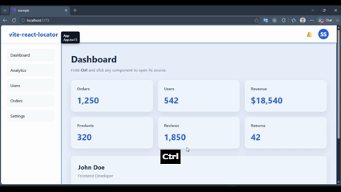
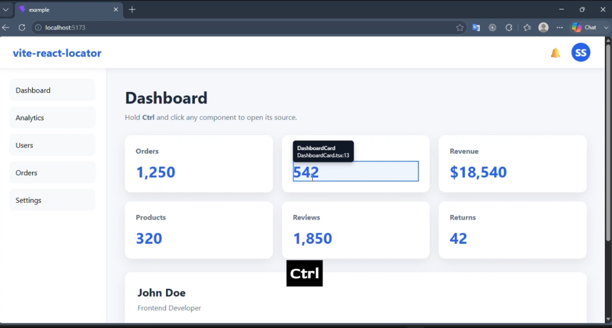
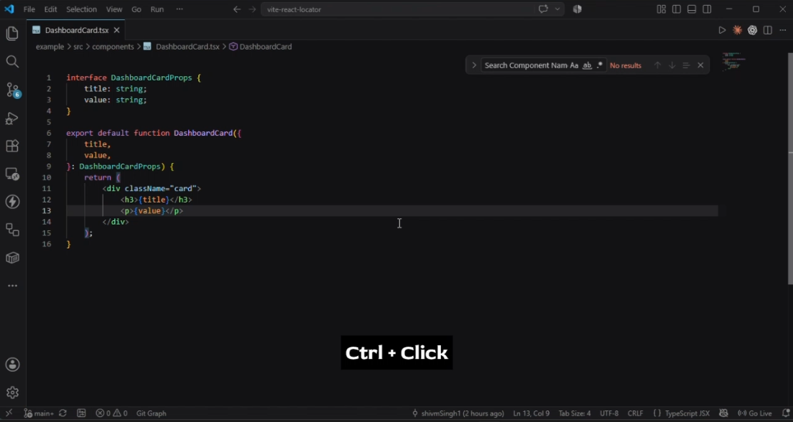

<div align="center">

# 🚀 vite-react-locator

### Instantly jump from your browser to the exact source location of any JSX element.

**Default:** Ctrl + Click • **Fully configurable**


<p align="center">

[](https://www.npmjs.com/package/vite-react-locator)
[](https://www.npmjs.com/package/vite-react-locator)
[](LICENSE)
[](https://vitejs.dev)
[](https://react.dev)
[](https://www.typescriptlang.org)

</p>

A lightweight Vite plugin that lets you hover any JSX element, inspect its source location, and jump directly to the exact line in your editor.

No browser extensions required.

</div>

---

# 🎬 Demo

<p align="center">
  
</p>

---

# ✨ Features

- ⚡ Lightweight and fast
- ⚛️ Works with React + Vite
- 🔍 Detects any JSX element automatically
- 🟦 Beautiful hover overlay
- ⚡ No browser extensions required
- 🔥 Opens the exact source location of the hovered JSX element
- 💬 Tooltip showing:
  - Component name
  - File name
  - Line number
- 🖱️ **Ctrl + Click** opens the hovered JSX element in VS Code
- ⌨️ Configurable activation key
- 🚀 Babel AST based transformation
- 📝 TypeScript support
- 📦 Zero runtime configuration

> 💡 Works only in development mode. Nothing is included in your production build.

---

# 📸 Demo

## Hover any JSX element

<p align="center">

</p>

---

## Ctrl + Click

<p align="center">

</p>

---

# 📦 Installation

```bash
npm install -D vite-react-locator
```

or

```bash
pnpm add -D vite-react-locator
```

or

```bash
yarn add -D vite-react-locator
```

---

# ✅ Compatibility

| Tool | Version / Status |
|------|------------------|
| Vite | 5+ |
| React | 18+ |
| TypeScript | ✅ Supported |
| JavaScript | ✅ Supported |
| Development Mode | ✅ Supported |
| Production Build | Not required |

---

# 🚀 Usage

## 1. Add the plugin

```ts
// vite.config.ts

import { defineConfig } from "vite";
import react from "@vitejs/plugin-react";
import locator from "vite-react-locator";

export default defineConfig({
  plugins: [
    react(),
    locator(),
  ],
});
```

---

## 2. Import the runtime

```ts
// src/main.tsx

import "vite-react-locator/runtime";
```

That's it.

Start your dev server.

```bash
npm run dev
```

---

## Optional Configuration

```ts
locator({
  activationKey: "Ctrl", // default
});
```

Examples:

```ts
locator({ activationKey: "Alt" });
locator({ activationKey: "Ctrl+Shift" });
locator({ activationKey: "Ctrl+Alt" });
locator({ activationKey: "Ctrl+Alt+Shift" });
```

Supports any combination of:

- Ctrl
- Alt
- Shift
- Meta

If no activation key is specified, **Ctrl** is used by default.

---

# 🎯 How to Use

1. Hold the configured activation key (default: **Ctrl**).
2. Hover over any JSX element.
3. A blue overlay and tooltip will appear.
4. Click the highlighted element.
5. It opens instantly in your editor.

---

# 📖 Example

Suppose your application contains

```tsx
function LoginButton() {
    return (
        <button>
            <span>Login</span>
        </button>
    );
}
```

Hover over the `<button>` or the `<span>` while holding **Ctrl**.

The hovered JSX element is highlighted, and **Ctrl + Click** opens its exact source location in VS Code.


---

# ⚙️ How It Works

```
React Component
        │
        ▼
Babel AST Transform
        │
        ▼
Inject Locator Metadata
        │
        ▼
Runtime detects hovered JSX element
        │
        ▼
Tooltip + Overlay
        │
        ▼
Ctrl + Click
        │
        ▼
Vite Dev Server
        │
        ▼
Open VS Code
```

---


# ⚡ Why use vite-react-locator?

Without this plugin

```
Inspect Component

↓

Inspect Element

↓

Search JSX

↓

Open File

↓

Find Line
```

With vite-react-locator

```
Ctrl + Click

↓

Done ✅
```

---

# 🛠 Supported Editors

| Editor | Status |
|---------|--------|
| VS Code | ✅ |
| Cursor | 🚧 Planned |
| VS Code Insiders | 🚧 Planned |
| WebStorm | 🚧 Planned |

---

# 🆕

## v1.1.0

### Added

- 🎯 Locate any JSX element
- 🖱️ Ctrl + Click opens the exact source location of the hovered JSX element

### Improved

- Better source mapping for nested JSX elements
- More accurate Babel AST transformation

---

# 📋 Roadmap

## v1.0.0

- [x] Component detection
- [x] Overlay
- [x] Tooltip
- [x] Editor integration
- [x] VS Code support
- [x] Runtime

## v1.0.1

- [x] Configurable activation key
- [x] Ctrl as default activation key

## v1.1.0

- [x] Locate any JSX element
- [x] Exact source mapping for JSX elements
- [x] Ctrl + Click opens the exact source location


## Future
- [ ] Cursor support
- [ ] VS Code Insiders support
- [ ] Better tooltip
- [ ] Editor selection
- [ ] Custom overlay colors

---

# 🤝 Contributing

Contributions are welcome.

If you'd like to improve the project:

1. Fork the repository
2. Create your feature branch

```bash
git checkout -b feature/amazing-feature
```

3. Commit your changes

```bash
git commit -m "feat: add amazing feature"
```

4. Push

```bash
git push origin feature/amazing-feature
```

5. Open a Pull Request

---

# 🐞 Found a Bug?

Please open an issue on GitHub.

Include

- Vite version
- React version
- Operating System
- Steps to reproduce

---

# 📄 License

MIT License © Shivam Singh

---

# ⭐ Support

If this project saves you time,

please consider giving it a ⭐ on GitHub.

It helps the project reach more developers.

---

<div align="center">

Made with ❤️ by **Shivam Singh**

</div>