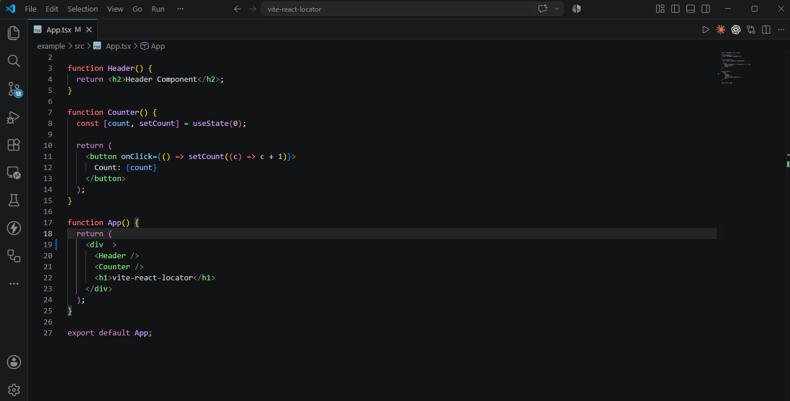

<div align="center">

# 🚀 vite-react-locator

### Instantly open any React component in your editor with **Alt + Click**


<p align="center">

[](https://www.npmjs.com/package/vite-react-locator)
[](https://www.npmjs.com/package/vite-react-locator)
[](LICENSE)
[](https://vitejs.dev)
[](https://react.dev)
[](https://www.typescriptlang.org)

</p>

A lightweight Vite plugin that lets you **hover React components**, inspect their source location, and **jump directly to the component file** in your editor using **Alt + Click**.

</div>

---

# ✨ Features

- ⚡ Lightweight and fast
- ⚛️ Works with React + Vite
- 🔍 Detects React components automatically
- 🟦 Beautiful hover overlay
- 💬 Tooltip showing:
  - Component name
  - File name
  - Line number
- 🖱️ **Alt + Click** opens the component in VS Code
- 🚀 Babel AST based transformation
- 📝 TypeScript support
- 📦 Zero runtime configuration

---

# 📸 Demo

## Hover any React component

<p align="center">

</p>

---

## Alt + Click

<p align="center">

</p>

---

# 📦 Installation

```bash
npm install -D vite-react-locator
```

or

```bash
pnpm add -D vite-react-locator
```

or

```bash
yarn add -D vite-react-locator
```

---

# 🚀 Usage

## 1. Add the plugin

```ts
// vite.config.ts

import { defineConfig } from "vite";
import react from "@vitejs/plugin-react";
import locator from "vite-react-locator";

export default defineConfig({
  plugins: [
    react(),
    locator(),
  ],
});
```

---

## 2. Import the runtime

```ts
// src/main.tsx

import "vite-react-locator/runtime";
```

That's it.

Start your dev server.

```bash
npm run dev
```

---

# 🎯 How to Use

1. Hold the **Alt** key.
2. Hover over any React component.
3. A blue overlay and tooltip will appear.
4. Press **Alt + Click**.
5. The component opens instantly in your editor.

---

# 📖 Example

Suppose your application contains

```tsx
function LoginButton() {
    return <button>Login</button>;
}
```

Move your mouse over the button while holding **Alt**.

You will see

```
LoginButton
LoginButton.tsx:8
```

Now press

```
Alt + Click
```

VS Code instantly opens

```
src/components/LoginButton.tsx
```

at the correct line.

---

# ⚙️ How It Works

```
React Component
        │
        ▼
Babel AST Transform
        │
        ▼
Inject Locator Metadata
        │
        ▼
Runtime detects hovered component
        │
        ▼
Tooltip + Overlay
        │
        ▼
Alt + Click
        │
        ▼
Vite Dev Server
        │
        ▼
Open VS Code
```

---


# ⚡ Why use vite-react-locator?

Without this plugin

```
Inspect Component

↓

Search Component Name

↓

Search Folder

↓

Open File

↓

Find Line
```

With vite-react-locator

```
Alt + Click

↓

Done ✅
```

---

# 🛠 Supported Editors

| Editor | Status |
|---------|--------|
| VS Code | ✅ |
| Cursor | 🚧 Planned |
| VS Code Insiders | 🚧 Planned |
| WebStorm | 🚧 Planned |

---

# 📋 Roadmap

## v1.0

- [x] React component detection
- [x] Overlay
- [x] Tooltip
- [x] Alt + Click
- [x] VS Code support

## v1.1

- [ ] Cursor support
- [ ] WebStorm support
- [ ] VS Code Insiders
- [ ] Better tooltip

## v1.2

- [ ] Configurable activation key
- [ ] Editor selection
- [ ] Custom overlay colors

---

# 🤝 Contributing

Contributions are welcome.

If you'd like to improve the project:

1. Fork the repository
2. Create your feature branch

```bash
git checkout -b feature/amazing-feature
```

3. Commit your changes

```bash
git commit -m "feat: add amazing feature"
```

4. Push

```bash
git push origin feature/amazing-feature
```

5. Open a Pull Request

---

# 🐞 Found a Bug?

Please open an issue on GitHub.

Include

- Vite version
- React version
- Operating System
- Steps to reproduce

---

# 📄 License

MIT License © Shivam Singh

---

# ⭐ Support

If this project saves you time,

please consider giving it a ⭐ on GitHub.

It helps the project reach more developers.

---

<div align="center">

Made with ❤️ by **Shivam Singh**

</div>